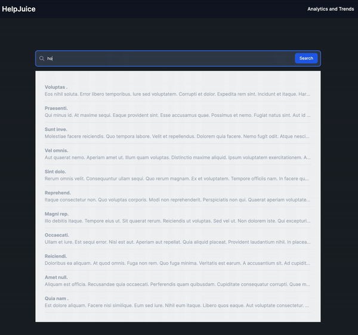

# Rails Realtime Article Search
## Description
This project is a realtime search box where users can search for articles. The search functionality uses the Jaro-Winkler string similarity algorithm to provide relevant search results. The analytics feature displays what users were searching for.
## JaroWinkler Algorithm

The `JaroWinkler` class is a Ruby implementation of the Jaro-Winkler string similarity algorithm. It is used in the [`SearchQuery`](app/models/search_query.rb) model to check the similarity between search queries. The class is defined in [`lib/jaro_winkler.rb`](lib/jaro_winkler.rb).
The `JaroWinkler` class has several methods including `find_matches`, `count_transpositions`, `count_prefix`, and `calculate_similarity`. The `similarity_distance` method, used in the [`SearchQuery`](app/models/search_query.rb) model, calculates the Jaro-Winkler similarity between two strings.

## Examples

### Good Example

Consider the following scenario where a user is searching:

1st (random) user searches for:
- What is
- What is a
- What is a good car

2nd (random) user searches for:
- How is
- How is emil hajric
- How is emil hajric doing

In this case, the search engine only records:
- What is a good car
- How is emil hajric doing

The rest are removed because they were incomplete searches.

### Bad Example (aka Pyramid Problem)

Consider the following scenario where a user is searching:

User searches:
- hello
- Hello world
- Hello world how are you?

In this case, the search engine records:
- hello
- Hello world
- Hello world how are you?

This is a bad example because the search engine didn't filter what the user searched for.
## Installation

1. Clone this repo to your local machine using `git clone <repo_url>`
2. Run `bundle install` to install all the gems
3. Run `rails db:create` to create the database
4. Run `rails db:migrate` to migrate the database
5. Run `rails db:seed` to seed the database
6. Run `rails s` to start the server
7. Open your browser and go to `localhost:3000` to view the app

## Test

1. Run `rspec` to run all the tests

## Installation
1. Clone this repo to your local machine using `git clone <repo_url>`
2. Run `bundle install` to install all the gems
3. Run `rails db:create` to create the database
4. Run `rails db:migrate` to migrate the database
5. Run `rails db:seed` to seed the database
6. Run `rails s` to start the server
7. Open your browser and go to `localhost:3000` to view the app

## Test
### Unit && Integration Tests
Run `rspec` to run all the tests

### Performance Load Tests
Run `rails load_test:test_performance ` to run perfomance load test on server using 1000 concurrent requests

